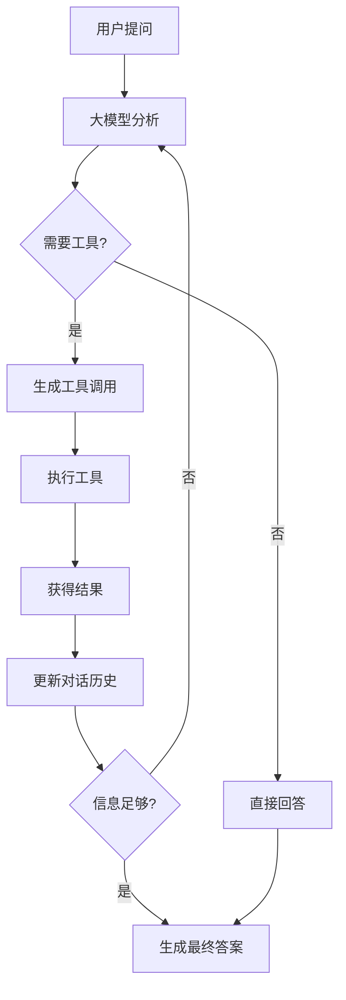

# 大模型工具调用机制详解

## 概述

本文档详细解释了大模型（LLM）如何与工具进行交互，包括参数传递机制、工具调用流程以及停止条件。基于LangChain框架的实际代码分析。

## 1. 大模型参数传递机制

### 1.1 Python函数签名提取

大模型能够知道工具参数的第一步是通过Python的`inspect.signature()`函数提取函数签名：

```python
# 在 langchain_core/tools/base.py 的 create_schema_from_function 中
sig = inspect.signature(func)
```

这个函数能够获取到：
- **参数名称**：函数的所有参数名
- **参数类型注解**：通过类型提示获得的参数类型
- **默认值**：参数的默认值（如果有）
- **参数是否必需**：根据是否有默认值判断

**示例**：
```python
@tool
def get_current_time(timezone: str = "UTC") -> str:
    """获取当前时间"""
    # ...
```

`inspect.signature()`会提取出：
- 参数名：`timezone`
- 类型：`str`
- 默认值：`"UTC"`

### 1.2 Pydantic Schema生成

LangChain使用`create_schema_from_function()`将函数签名转换为Pydantic模式：

```python
def create_schema_from_function(
    model_name: str,
    func: Callable,
    *,
    filter_args: Sequence[str] = (),
    parse_docstring: bool = False,
    error_on_invalid_docstring: bool = False,
    infer_schema: bool = True,
) -> Type[BaseModel]:
    # 使用 pydantic.validate_arguments 创建模式
    validated = validate_arguments(func, config=config)
    # 返回 Pydantic 模型
    return validated.model
```

生成的JSON Schema示例：
```json
{
  "type": "object",
  "properties": {
    "timezone": {
      "type": "string",
      "default": "UTC"
    }
  },
  "required": []
}
```

### 1.3 @tool装饰器的作用

`@tool`装饰器通过以下步骤处理函数：

1. **函数签名分析**：提取参数信息
2. **Schema生成**：创建JSON Schema描述参数结构
3. **工具注册**：将工具添加到可用工具列表
4. **元数据提取**：从docstring提取工具描述

## 2. 大模型调用工具机制

### 2.1 工具绑定过程

```python
model_with_tools = chat_model.bind_tools(tools)
```

`bind_tools()`方法执行以下操作：

1. **Schema打包**：将所有工具的schema信息打包
2. **系统提示**：通过系统提示词告诉大模型可用的工具及其参数格式
3. **调用指导**：指导大模型如何格式化工具调用

大模型接收到的信息类似：
```
可用工具：
1. get_current_time
   - 参数：timezone (string, 可选, 默认: "UTC")
   - 描述：获取当前时间

2. advanced_calculator
   - 参数：expression (string, 必需)
   - 描述：执行数学计算
```

### 2.2 工具调用流程



### 2.3 多工具调用支持

大模型可以在一次响应中返回多个工具调用：

```python
for tool_call in response.tool_calls:  # tool_calls是列表
    tool_name = tool_call["name"]
    tool_args = tool_call["args"]
    tool_id = tool_call["id"]
    # 处理每个工具调用
```

**并行执行示例**：
```json
{
  "tool_calls": [
    {
      "name": "get_current_time",
      "args": {"timezone": "UTC"},
      "id": "call_1"
    },
    {
      "name": "weather_simulator", 
      "args": {"location": "北京", "date": "2024-01-15"},
      "id": "call_2"
    }
  ]
}
```

### 2.4 工具调用解析

当大模型决定使用工具时，返回结构化信息：

```python
tool_args = tool_call["args"]  # 第598行
```

大模型知道传递什么参数是因为：

1. **Schema约束**：根据提供的JSON Schema生成符合格式的参数
2. **类型匹配**：理解参数类型并生成相应格式的值
3. **必需性检查**：知道哪些参数必需，哪些可选
4. **默认值处理**：对有默认值的参数可选择不传递

## 3. 大模型停止工具调用的机制

### 3.1 主要停止条件：大模型自主决定

```python
# 如果这轮没有工具调用，说明任务完成
if not (hasattr(response, "tool_calls") and response.tool_calls):
    break
```

大模型会在以下情况自主决定停止：

- **任务已完成**：认为已获得足够信息回答用户问题
- **目标达成**：通过工具调用已解决用户需求
- **信息充足**：已收集到足够数据生成最终答案

### 3.2 安全停止条件：最大迭代次数限制

```python
max_iterations = 5  # 防止无限循环
while iteration < max_iterations:
    # 工具调用逻辑
```

这是安全机制，防止：
- 大模型陷入无限循环
- 工具调用链过长导致资源浪费
- 系统响应时间过长

### 3.3 大模型决策机制

#### 决策过程

1. **上下文分析**：分析整个对话历史
   - 用户的原始问题
   - 之前工具调用的结果
   - 当前已获得的信息

2. **任务完成度评估**：判断
   - 是否已获得回答问题所需的所有信息
   - 是否需要更多数据完善答案
   - 当前信息是否足够准确和完整

3. **生成策略选择**：选择
   - 继续调用工具获取更多信息
   - 基于现有信息生成最终答案

#### 典型停止场景

1. **信息收集完成**：
   ```
   用户：今天北京天气如何？
   大模型：调用天气工具 → 获得天气信息 → 信息充足 → 停止调用 → 生成答案
   ```

2. **计算任务完成**：
   ```
   用户：计算100*1.08等于多少？
   大模型：调用计算器 → 获得结果108 → 任务完成 → 停止调用 → 返回答案
   ```

3. **复合任务完成**：
   ```
   用户：帮我查询当前时间并计算一个数学表达式
   大模型：调用时间工具 → 调用计算器 → 两个任务都完成 → 停止调用 → 综合答案
   ```

## 4. 完整工作流程总结

### 4.1 定义阶段
- `@tool`装饰器提取函数签名并生成schema
- 工具注册到可用工具列表

### 4.2 绑定阶段
- `bind_tools()`将schema信息传递给大模型
- 系统提示告知大模型可用工具和使用方法

### 4.3 推理阶段
- 大模型根据schema和上下文决定调用哪个工具
- 生成符合schema格式的参数

### 4.4 执行阶段
- 代码解析`tool_call["args"]`并调用相应工具函数
- 将工具结果添加到对话历史

### 4.5 迭代阶段
- 大模型基于工具结果决定是否需要更多工具调用
- 重复执行直到任务完成或达到最大迭代次数

## 5. 关键技术要点

1. **类型安全**：通过Pydantic确保参数类型正确
2. **错误处理**：工具执行失败时的优雅降级
3. **循环控制**：防止无限循环的安全机制
4. **状态管理**：维护完整的对话历史和工具调用记录
5. **并发支持**：支持单轮多工具调用

这套机制确保了大模型能够安全、高效地与各种工具进行交互，为构建复杂的AI应用提供了坚实的基础。